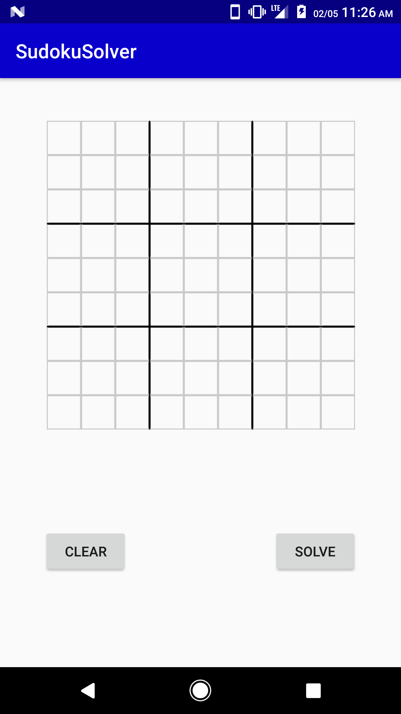
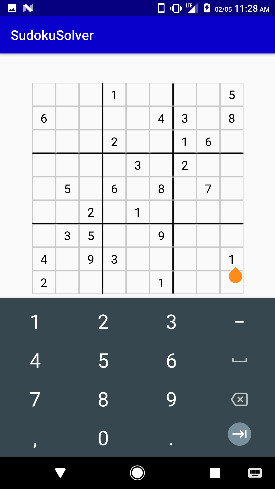
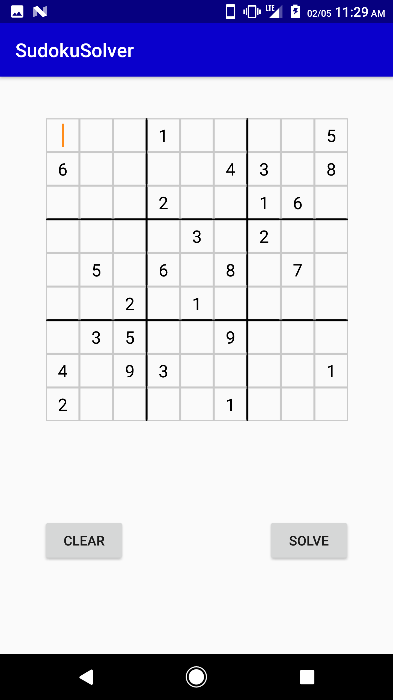

# SudokuApp
Android App for solving Sudoku puzzles

## Process
Input given numbers and hit solve.

1. When app is opened, an empty 9x9 Sudoku grid is displayed


2. Fill in the grid with known values


3. Once filled, hit the ```SOLVE``` button on the bottom right


4. The answer values appear in blue


5. Hit the ```Clear``` button on the bottom left to empty the grid once more

